# Mapa wywolan funkcji dla src

Ten dokument pokazuje statyczny obraz wywolan funkcji w calym katalogu src.

## Zakres
- Wejscie aplikacji: `src/main.cpp`
- Orkiestracja runtime: `src/app/*`
- Geometria i IPC: `src/app/GeometryIpc.*`, `src/geometry/*`
- Model parametryczny: `src/model/*`
- Szkic 2D i solver: `src/sketch/*`
- UI: `src/ui/*`
- Renderowanie: `src/renderer/*`
- Kamera i scena: `src/scene/*`
- I/O modelu: `src/io/*`
- Dodatkowe moduly: `src/git/*`, `src/ai/*`, `src/core/*`

## Przeplyw glowny (high-level)

```mermaid
flowchart TD
    A["main()"] --> B["Application::init"]
    B --> B1["load_settings"]
    B --> B2["SDL_Init"]
    B --> B3["Window::create"]
    B --> B4["VulkanContext::init"]
    B --> B5["RenderFrame::init"]
    B --> B6["init_imgui"]
    B --> B7["MainOrchestrator::init"]
    B --> B8["init_imgui_backend"]
    B --> B9["load_model_session"]
    B9 --> B10["ModelDeserializer::from_file"]
    B --> B11["FeatureTree::create_feature"]
    B --> B12["SketchDocument::solve"]
    B12 --> B13["SketchSolver::solve_incremental"]
    B --> B14["sync_camera_to_viewport"]

    A --> C["Application::run"]
    C --> C1["SDL_PollEvent loop"]
    C1 --> C2["window_.process_event"]
    C1 --> C3["camera_.handle_event"]
    C1 --> C4["ImGui_ImplSDL3_ProcessEvent"]
    C1 --> C5["SketchDocument::exit + build_sketch_segments_for_ipc"]
    C5 --> C6["MainOrchestrator::submit_once RebuildFromSketch"]

    C --> C7["MainOrchestrator::submit_once FrameUpdate"]
    C --> C8["Application::render_vulkan_frame"]
    C8 --> C9["VulkanContext::begin_frame"]
    C8 --> C10["build_docked_layout"]
    C10 --> C11["FeatureTreePanel::draw"]
    C10 --> C12["ViewportPanel::draw"]
    C10 --> C13["PropertiesPanel::draw"]
    C10 --> C14["process_feature_tree_actions"]
    C14 --> C15["FeatureTreePanel::consume_rebuild_intent"]
    C14 --> C16["execute_feature_rebuild"]
    C16 --> C17["FeatureTree::rebuild"]
    C17 --> C18["MainOrchestrator::submit_once RebuildFeature"]
    C17 --> C19["submit_once Tessellate"]
    C17 --> C20["submit_once UploadMesh"]
    C17 --> C21["submit_once Repaint"]
    C10 --> C22["SketchView::draw_overlay"]
    C10 --> C23["SketchDocument::solve"]
    C8 --> C24["sync_camera_to_viewport"]
    C8 --> C25["ImGui_ImplVulkan_RenderDrawData"]
    C8 --> C26["VulkanContext::end_frame"]

    A --> D["Application::shutdown"]
    D --> D1["persist_settings"]
    D --> D2["MainOrchestrator::shutdown"]
    D --> D3["shutdown_imgui"]
    D --> D4["RenderFrame::shutdown"]
    D --> D5["VulkanContext::shutdown"]
    D --> D6["Window::destroy"]
    D --> D7["SDL_Quit"]
```

## Wywolania caller -> callee (najwazniejsze)

### start i lifecycle
- `main` -> `Application::init`
- `main` -> `Application::run`
- `main` -> `Application::shutdown`

### init
- `Application::init` -> `load_settings`
- `Application::init` -> `SDL_Init`
- `Application::init` -> `Window::create`
- `Application::init` -> `VulkanContext::init`
- `Application::init` -> `RenderFrame::init`
- `Application::init` -> `init_imgui`
- `Application::init` -> `MainOrchestrator::init`
- `Application::init` -> `init_imgui_backend`
- `Application::init` -> `load_model_session`
- `Application::init` -> `ModelDeserializer::from_file`
- `Application::init` -> `FeatureTree::create_feature`
- `Application::init` -> `SketchDocument::solve`
- `Application::init` -> `sync_camera_to_viewport`

### run loop
- `Application::run` -> `SDL_PollEvent`
- `Application::run` -> `window_.process_event`
- `Application::run` -> `camera_.handle_event`
- `Application::run` -> `build_sketch_segments_for_ipc`
- `Application::run` -> `MainOrchestrator::submit_once` (FrameUpdate/RebuildFromSketch)
- `Application::run` -> `render_vulkan_frame`

### render i UI
- `Application::render_vulkan_frame` -> `VulkanContext::begin_frame`
- `Application::render_vulkan_frame` -> `build_docked_layout`
- `Application::render_vulkan_frame` -> `sync_camera_to_viewport`
- `Application::render_vulkan_frame` -> `ImGui_ImplVulkan_RenderDrawData`
- `Application::render_vulkan_frame` -> `VulkanContext::end_frame`
- `Application::build_docked_layout` -> `FeatureTreePanel::draw`
- `Application::build_docked_layout` -> `ViewportPanel::draw`
- `Application::build_docked_layout` -> `PropertiesPanel::draw`
- `Application::build_docked_layout` -> `process_feature_tree_actions`
- `Application::build_docked_layout` -> `SketchView::draw_overlay`
- `Application::build_docked_layout` -> `SketchDocument::solve` (gdy sketch aktywny)

### pipeline rebuildu
- `Application::process_feature_tree_actions` -> `FeatureTreePanel::consume_open_sketch_request`
- `Application::process_feature_tree_actions` -> `FeatureTreePanel::consume_rebuild_intent`
- `Application::process_feature_tree_actions` -> `execute_feature_rebuild`
- `Application::execute_feature_rebuild` -> `FeatureTree::rebuild`
- `FeatureTree::rebuild` -> callback delegate (z `Application::execute_feature_rebuild`)
- callback delegate -> `MainOrchestrator::submit_once(RebuildFeature)`
- `FeatureTree::rebuild` -> `tessellate/upload_mesh/repaint` callbacki
- callbacki -> `MainOrchestrator::submit_once(Tessellate/UploadMesh/Repaint)`

### IPC i geometria
- `MainOrchestrator::init` -> `GeometryWorker::start`
- `MainOrchestrator::shutdown` -> `GeometryWorker::stop`
- `MainOrchestrator::submit_once` -> `GeometryWorker::execute`
- `GeometryWorker::execute(RebuildFeature)` -> `build_feature_proxy_solid` -> `OcctKernel::createBox`
- `GeometryWorker::execute(RebuildFromSketch)` -> `OcctKernel::createEdge`
- `GeometryWorker::execute(PickSolid)` -> `OcctKernel::pickSolid` + `OcctKernel::getEdges`

### szkic i solver
- `SketchDocument::solve` -> `sync_lines_from_points`
- `SketchDocument::solve` -> `SketchSolver::solve_incremental`
- `SketchDocument::solve` -> `sync_points_from_lines`
- `SketchSolver::solve_incremental` -> `apply_constraint`
- `SketchSolver::solve_incremental` -> `estimate_dof`

### IO modelu
- `Application::load_model_session` -> `ModelDeserializer::from_file`
- `ModelDeserializer::from_file` -> `ModelDeserializer::from_string`
- `ModelDeserializer::from_string` -> `resolve_parameters`
- `ModelSerializer::save_to_file` -> `ModelSerializer::to_string`
- `ModelSerializer::to_string` -> `ModelSerializer::to_json`

## Moduly o malej ilosci runtime-calli
- `src/ai/*.hpp`: definicje struktur konfiguracyjnych
- `src/core/ExpectedCompat.hpp`: kompatybilnosc typow
- `src/git/LocalRepoManager.*`: logika repo lokalnego, slabo sprzezona z glowna petla

## Punkty ryzyka regresji (call graph hot spots)
- `Application::run`
- `Application::execute_feature_rebuild`
- `FeatureTree::rebuild`
- `MainOrchestrator::submit_once`
- `GeometryWorker::execute`
- `SketchSolver::solve_incremental`
- `ModelDeserializer::from_string`
